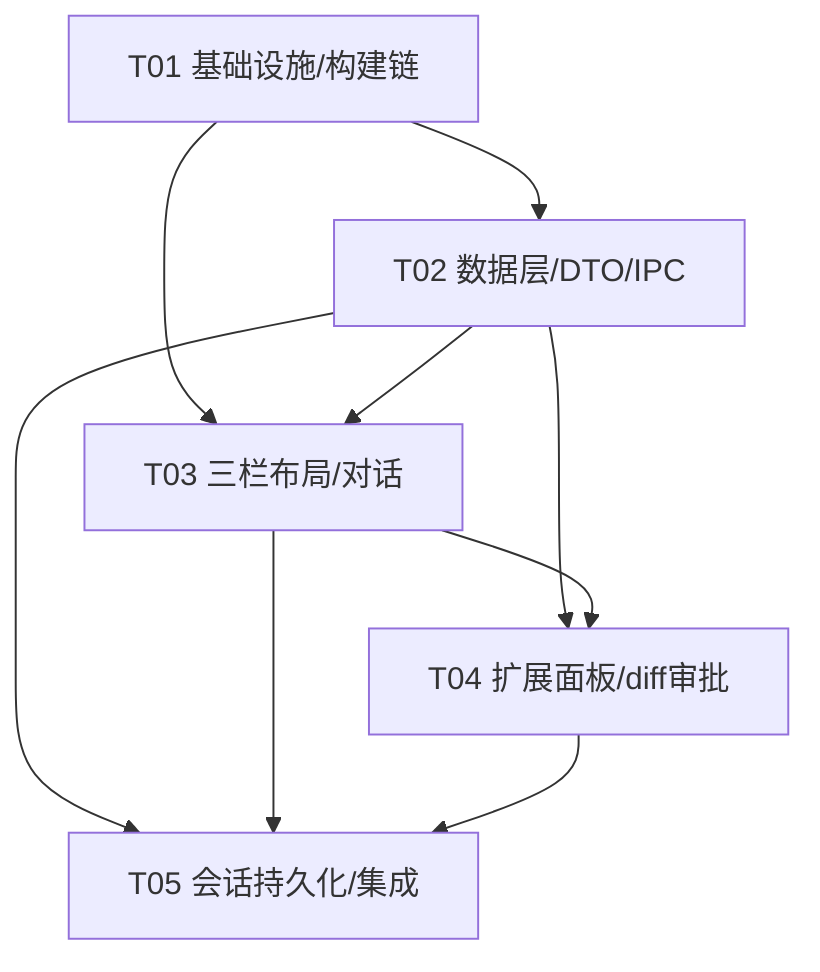

# Ravel Desktop 渲染层现代化（React + MUI + Tailwind）系统设计与任务分解

> 架构师：**高见远**（software-architect）
> 输入：PRD（产品经理 许清楚）、用户 4 项决策、现有 `apps/ravel-desktop` 代码与 `.pi/extensions` 状态文件 schema
> 目标：记录当前实现基线、受控 DTO/IPC 边界与后续演进约束
> 安全红线：**渲染进程不拥有文件系统、Git、凭据或 Pi SDK 权限；默认事件使用有界 DTO，完整工具详情必须经受控 IPC 按需读取。**
> 维护说明：本文早期 V1 任务分解中的自定义 JSON persistence、旧 vanilla renderer 与部分扩展 IPC 已完成迁移或删除。后续铬件换栈与 Histos 落地顺序见仓库根 [`docs/ravel-histos-refactor-plan.md`](../../../docs/ravel-histos-refactor-plan.md)。
> 2026-08-26 切片 0：`journal-workflow` / `exploration-scout` 两个内置插件及其 `WorkflowPanel` / `ScoutPanel` / `state-reader.js` / `omega:queryExtensionState` 链路已整体删除；右栏只保留 Diff / Worktree，默认 Diff。本文涉及 workflow*/scout* DTO、Scout 模式与扩展状态拉取的章节仅作历史记录，不再反映现状。

---

## 0. 结论速览（TL;DR）

| 维度 | V1 决策 |
|---|---|
| 渲染层技术栈 | React 18 + MUI 5 + Tailwind 3（替换 vanilla `renderer.js`） |
| 构建工具 | **Vite 5**，产物为**单文件 IIFE 经典脚本**（`format:'iife'`），避免 ES module / `file://` 与 `script-src 'self'` 冲突 |
| 样式安全 | Tailwind 产出外部 CSS（满足 `style-src 'self'`）；MUI/emotion 运行时 `<style>` 用**构建期常量 nonce**（`style-src 'self' 'nonce-…'`），**不引入 `unsafe-inline'`** |
| preload/IPC 契约 | `window.omega.{prompt,onStatus,onEvent}` **保持不动**；在其上**扩展** `queryExtensionState / listSessions / newSession / loadSession / saveSession / deleteSession / diffWorkspace / approveChange` |
| 状态管理 | **Zustand**（轻量、避免高频 delta 重渲染风暴），单 store |
| 扩展 Web 化数据源 | 只读读取 `.pi/extensions` 的 **append-only 状态文件**（catalog/registry/tracker/coverage/rounds.jl + 派生 health/stats），由新增主进程模块 `state-reader.js` 派生为受控 DTO |
| diff + 审批 | **(a) post-hoc 只读 git diff** 为 V1 主方案：预览=`git diff` 结构化 DTO；审批 reject=主进程 `git checkout -- <file>`（仅 git 管理文件），accept=保留。主进程特权执行，渲染进程无写权限 |
| 会话持久化 | 当前以 Pi JSONL / `SessionManager` 作为 session、消息、tree 和分支的权威源；Ravel 仅维护桌面设置、草稿、workspace registry、event cache 和必要 UI 缓存 |

---

## 1. 实现方案 + 框架选型

### 1.1 总体工程化方式

现有 `renderer.js` 是纯 vanilla、通过 `<script src="./renderer.js">` 以**经典脚本**加载（非 module）。改为 React 后，必须解决三个硬约束：

1. **CSP `default-src 'self'; script-src 'self'`** —— 不允许任何 inline `<script>` / `eval`。因此**不能**用 Vite dev server 的 HMR（`eval`）、**不能**用 `vite-plugin-singlefile`（会把 JS inline 进 HTML）、**不能**用原生 ES module（Electron `file://` 下 module script 有 CORS 问题）。
2. **`style-src 'self'`** —— Tailwind 外部 CSS 天然满足；但 MUI/emotion 在运行时注入 `<style>` 元素，会被 `style-src 'self'`（无 `unsafe-inline'`）拦截。
3. **安全边界** —— 渲染进程只能收净化 DTO，preload 必须保持「窄而经过校验」。

对应方案：

- **构建产物 = 单文件 IIFE 经典脚本**：`vite.config.ts` 中 `build.rollupOptions.output.format='iife'` + `inlineDynamicImports:true` + `build.modulePreload:false`，输出 `dist/assets/index.js`（单 chunk、经典脚本）与 `dist/assets/index.css`（外部样式表）。`index.html` 仍以 `<script src="./dist/assets/index.js">` 经典方式引用。
- **样式 nonce（安全可保留）**：使用一个**构建期常量静态 nonce**（当前值为 `ravel-static-2026`，提交进仓库，本地桌面应用可接受静态值）。`index.html` 的 CSP 为 `style-src 'self' 'nonce-ravel-static-2026'`（**仍无 `unsafe-inline'`**）；emotion 通过 `createCache({ key:'mui', nonce: <同一静态值> })` 把同一 nonce 写到注入的 `<style>` 上。这样既用上 MUI，又不放松脚本/内联安全 posture。
- **dev 循环**：由于 dev server 会破坏 CSP，采用「`vite build --watch` + `electron .`」的监听构建模式，或 `vite build` 后 `electron .` 加载 `dist/`。不跑带 HMR 的 dev server。

### 1.2 与现有 electron-builder 打包的衔接

现有 `electron-builder.yml` 的 `files` 把 `index.html` / `styles.css` / `renderer.js` 打进 asar。改造后：

- `files` 改为包含 `dist/**/*`（Vite 产物）、`index.html`、`electron/**/*`、`package.json`；移除 `renderer.js` / `styles.css`（被 `dist/` 取代，或保留 `styles.css` 仅作首屏骨架样式——V1 建议直接由 `dist/index.css` 接管，删除旧 `styles.css`）。
- `extraResources` 不变（仍拷贝 `.pi/extensions` 与 `packages/coding-agent/dist`）。
- `electron/main.js` 的 `rendererPath()` 仍指向 `index.html`（位置不变），新 `index.html` 引用 `./dist/assets/*`。

### 1.3 依赖包清单

> 版本按仓库「依赖 pin 到精确版本」规则（`npm run check:pinned-deps`）由工程师填精确版本号；下表只列用途与大致主版本。

**渲染进程（runtime，`apps/ravel-desktop/package.json` 的 dependencies / devDependencies）：**

| 包 | 用途 | 类型 |
|---|---|---|
| `react`@18, `react-dom`@18 | UI 框架（组件化、三栏布局、虚拟 DOM） | dep |
| `@mui/material`@5 | 组件库（AppBar / Drawer / Card / Tabs / List / Dialog 等） | dep |
| `@mui/icons-material`@5 | 图标 | dep |
| `@emotion/react`@11, `@emotion/styled`@11 | MUI 样式引擎 | dep |
| `@emotion/cache`@11 | 带 nonce 的 emotion cache（满足 CSP） | dep |
| `zustand`@4 | 全局状态管理（轻量、避免高频 delta 重渲染） | dep |
| `react-markdown`@9 + `remark-gfm`@4 | Markdown 渲染（P0：消息 Markdown 化） | dep |
| `rehype-highlight`@7 + `highlight.js`@11 | 代码块语法高亮（P0：代码渲染） | dep |
| `clsx`@2 | Tailwind 类名合并（可选，推荐） | dep |
| `vite`@5, `@vitejs/plugin-react`@4 | 构建链 | devDep |
| `typescript`@5, `@types/react`@18, `@types/react-dom`@18 | 类型 | devDep |
| `tailwindcss`@3, `postcss`@8, `autoprefixer`@10 | 原子化样式 + 构建 | devDep |

**主进程（Node 侧，已在 `electron/` 内，仅 Node 运行，不参与 CSP）：**

| 包 | 用途 | 类型 |
|---|---|---|
| `diff`@5 | 在主进程把 `git diff` 统一输出解析为结构化 hunk（给 `WorkspaceDiff`） | devDep（main 用，可随 app 打包） |
| `simple-git`@3（可选） | 封装 git 调用，替代裸 `child_process`（若团队偏好） | devDep |

> 说明：渲染进程**不**导入 `@earendil-works/pi-coding-agent`；agent SDK 仅在主进程（已是 `node_modules` 到 `packages/coding-agent` 的 junction）。React 侧零原生依赖，electron-builder 无需 rebuild。

### 1.4 对现有 preload / IPC 契约的兼容

- **`preload.js` 保持 `contextBridge.exposeInMainWorld("omega", {...})` 结构**，原有 `prompt / onStatus / onEvent` 三个方法**原样保留**。新增的方法（见 §3.3）在同一对象内追加，每个新方法的实现都走 `ipcRenderer.invoke("omega:xxx", payload)`，并在 preload 层做**同样的最小校验**（非空、长度上限），与主进程 `senderAllowed` 双重把关。
- **`agent-bridge.js` 的 `createSession` / `streamToRenderer` 不变**；仅扩展 `toRendererEvent` 以额外产出 `tool_execution_summary`（见 §3.2），且不改变既有事件类型。
- 任何破坏 `window.omega` 既有方法签名或 `agent:event` 既有字段的改动都视为回归，需在 `test/renderer-model.test.mjs` 中加断言。

---

## 2. 界面结构 + 文件清单

### 2.1 三栏布局与组件树

```
App (ThemeProvider + 全局事件订阅)
└─ Workbench (三栏 CSS Grid：左固定 / 中弹性 / 右可折叠)
   ├─ Header                        顶栏：品牌 + 连接状态 + 模式(Scout) + 视图切换
   ├─ LeftNav                       会话列表/切换/新建 + 扩展入口(Workflow/Scout)
   │   └─ SessionList / NewSessionDialog
   ├─ ChatPanel (中栏)
   │   ├─ EmptyState
   │   ├─ MessageList → MessageBubble  (Markdown + 代码高亮)
   │   ├─ ToolCard (升级版：结构化摘要 + 折叠)
   │   └─ Composer (输入框 + 命令入口 "/")
   └─ RightPanel (可折叠：工作现场/辅助)
       ├─ WorkflowPanel   (catalog/registry/tracker/coverage/stats/health 标签页)
       ├─ ScoutPanel      (status/rounds/proposals)
       └─ DiffViewer + ApprovalBar (变更预览 + accept/reject)
```

### 2.2 状态管理选型

**Zustand 单 store**（`src/renderer/store/useAppStore.ts`）。理由：

- agent 事件流是高频、append-only delta（text_delta / tool_*），用 Context 会触发整树重渲染；Zustand 的 selector 订阅可精确更新消息/工具卡，避免重渲染风暴。
- 轻量、无 Provider 嵌套，契合「最小抽象」原则；API 极简（`create` / `set` / `get`），易于测试。
- 备选 Context+useReducer 也可，但高频场景性能差，故推荐 Zustand。（此为待确认点，见 §6。）

store 切片：`connection`、`sessions`、`activeSessionId`、`messages`（Map/数组）、`toolCards`、`extensionState`（workflow*/scout* DTO）、`diff`、`approval`、`layout`（右栏折叠/视图模式）、`permission`/`plan`（占位）。

### 2.3 文件清单（路径 + 职责）

**构建 / 配置（T01）**

| 路径 | 职责 |
|---|---|
| `apps/ravel-desktop/package.json` | 更新 deps + scripts（`dev`=vite build --watch+electron；`build:renderer`；`typecheck` 改为 tsc + node --check electron） |
| `apps/ravel-desktop/vite.config.ts` | Vite：root=app、entry=`src/renderer/main.tsx`、IIFE 单 chunk、`base:'./'`、`outDir:dist` |
| `apps/ravel-desktop/tailwind.config.ts` | Tailwind content globs + 从 `theme/tokens.ts` 生成颜色/间距/圆角 |
| `apps/ravel-desktop/postcss.config.js` | tailwindcss + autoprefixer |
| `apps/ravel-desktop/tsconfig.renderer.json` | 渲染进程 TS（jsx:react-jsx, moduleResolution:bundler） |
| `apps/ravel-desktop/index.html` | 改写为 Vite 入口（引用 `./dist/assets/*`），**保留并微调 CSP**（加 style nonce） |
| `apps/ravel-desktop/electron/main.js` | 新增 `omega:*` 的 `ipcMain.handle`；改造会话生命周期（多会话注册表） |
| `apps/ravel-desktop/electron/preload.js` | 扩展 `window.omega` 新增查询/会话/diff/审批方法（带校验） |
| `apps/ravel-desktop/electron-builder.yml` | `files` 改为 `dist/**/*`，移除 `renderer.js`/`styles.css` |

**主进程新增模块（T02）**

| 路径 | 职责 |
|---|---|
| `apps/ravel-desktop/electron/state-reader.js` | 只读读取扩展 append-only 状态文件 → 受控 DTO（workflow*/scout*）；安全过滤 |
| `apps/ravel-desktop/electron/diff-service.js` | 主进程 git diff → `WorkspaceDiff`；revert → `ChangeApprovalResult`（特权） |
| `apps/ravel-desktop/electron/session-reader.js` | 受控读取 Pi JSONL session 摘要、树和分页消息；不构成第二份 transcript authority |

**数据层（T02，渲染侧）**

| 路径 | 职责 |
|---|---|
| `apps/ravel-desktop/src/renderer/types/dto.ts` | 所有受控 DTO TS 接口 + `IpcResult<T>` 信封 |
| `apps/ravel-desktop/src/renderer/types/events.ts` | 扩展后的渲染事件流类型（含 `tool_execution_summary`） |
| `apps/ravel-desktop/src/renderer/ipc/client.ts` | 封装 `window.omega.*`（prompt + 新查询/会话/diff/审批） |
| `apps/ravel-desktop/src/renderer/store/useAppStore.ts` | Zustand 全局状态 |
| `apps/ravel-desktop/src/renderer/theme/tokens.ts` | 设计 token 单一来源（颜色/间距/圆角） |
| `apps/ravel-desktop/src/renderer/theme/emotion-cache.ts` | 带 nonce 的 MUI emotion cache |
| `apps/ravel-desktop/src/renderer/theme/ThemeProvider.tsx` | MUI `createTheme` + `StyledEngineProvider` + `CacheProvider` |

**布局与核心组件（T03）**

| 路径 | 职责 |
|---|---|
| `src/renderer/main.tsx` | React 挂载入口 |
| `src/renderer/App.tsx` | 顶层：ThemeProvider + Workbench + 订阅 `agent:event`/`app:bootstrap-error` |
| `src/renderer/components/layout/Workbench.tsx` | 三栏栅格容器（右栏可折叠） |
| `src/renderer/components/layout/Header.tsx` | 顶栏（连接状态/Scout 模式/视图切换） |
| `src/renderer/components/layout/LeftNav.tsx` | 会话/扩展导航 |
| `src/renderer/components/layout/RightPanel.tsx` | 可折叠右栏容器（Tabs） |
| `src/renderer/components/chat/ChatPanel.tsx` | 中栏：消息列表 + 空态 |
| `src/renderer/components/chat/MessageList.tsx` | 消息虚拟/增量列表 |
| `src/renderer/components/chat/MessageBubble.tsx` | 单条消息（Markdown + 代码高亮） |
| `src/renderer/components/chat/ToolCard.tsx` | 升级版工具卡（结构化摘要 + 折叠） |
| `src/renderer/components/chat/Composer.tsx` | 输入框 + 命令入口（"/" 触发命令面板，复用 prompt 通道） |
| `src/renderer/components/chat/EmptyState.tsx` | 空态/示例提示 |
| `src/renderer/components/common/Markdown.tsx` | react-markdown 封装（**禁用 raw HTML**，防 XSS） |
| `src/renderer/components/common/CodeBlock.tsx` | highlight.js 代码块 |

**扩展面板 + 工具卡升级 + diff/审批（T04）**

| 路径 | 职责 |
|---|---|
| `src/renderer/components/panels/WorkflowPanel.tsx` | journal-workflow Web 化（catalog/registry/tracker/coverage/stats/health 子标签） |
| `src/renderer/components/panels/ScoutPanel.tsx` | exploration-scout Web 化（status/rounds/proposals） |
| `src/renderer/components/panels/DiffViewer.tsx` | 结构化 diff 展示（文件列表 + hunk） |
| `src/renderer/components/panels/ApprovalBar.tsx` | accept/reject 审批条 |

**会话持久化 + 命令 + 视图 + 集成（T05）**

| 路径 | 职责 |
|---|---|
| `src/renderer/components/sessions/SessionList.tsx` | 会话列表/切换/删除 |
| `src/renderer/components/sessions/NewSessionDialog.tsx` | 新建会话（项目/标题/工作区） |
| `src/renderer/components/layout/CommandPalette.tsx` | 命令面板（可选，P0 命令入口） |
| `test/electron-security.test.mjs` | 扩展：断言新 IPC 通道仍走 senderAllowed、DTO 无敏感字段 |
| `test/renderer-model.test.mjs` | 扩展：断言既有 `agent:event` 字段不被破坏 |

---

## 3. 新增受控 DTO 与 IPC 设计

### 3.1 DTO 总览（名称 / 数据源 / 安全结论）

| DTO | 数据源（主进程派生） | 安全结论 |
|---|---|---|
| `WorkflowCatalog` | `workflowsRoot/catalog.json`（`WorkflowStore.getCatalogFeatures()`） | 安全（无 thinking） |
| `WorkflowRegistry` | `workflowsRoot/registry.json`（`WorkflowStore.getRegistry()`） | 安全 |
| `WorkflowTracker` | `journalsRoot/<projectKey>/<taskId>/tracker.json`（`TrackerSnapshot`） | 安全（运行时快照，无思考） |
| `WorkflowMemoryCoverage` | `…/memory/coverage.json` | 安全（仅水位，无正文） |
| `WorkflowStats` | 对 journal 目录只读扫描派生（`/wf-stats` 逻辑） | 安全（计数/路径，无正文） |
| `WorkflowHealth` | `/wf-health` 逻辑（`HealthReport`） | 安全（状态/计数/错误码；**不输出 payload/thinking**，符合原插件约定） |
| `ScoutStatus` | exploration-scout 当前 mode/policy（会话 state） | 安全 |
| `ScoutRounds` | `explorationsRoot/<projectKey>/<taskId>/rounds.jl` replay（`ExplorationJournalState`） | 安全；**DTO 显式丢弃 `rawOutput`** |
| `ScoutProposals` | 最新 round 的 `runs[].report.proposals`（公开字段） | 安全；仅 proposal/observation，非 thinking |
| `AgentPermissionState` | V1 占位：由会话配置/主进程权限档位派生（**SDK 0.84.2 未暴露 permission 事件**，见 §6） | 安全（占位） |
| `AgentPlan` | V1 占位：若 SDK 暴露 plan 事件则映射，否则由首条 assistant 文本轻量派生 | 安全（占位） |
| `WorkspaceDiff` | 主进程 `git diff`（只读） | 安全（只读） |
| `ChangeApprovalResult` | 主进程执行 revert 的结果 | 安全（仅结果元数据） |

> 统一信封：`type IpcResult<T> = { ok: true; data: T } | { ok: false; code: string; message: string }`，与现有 `agent:prompt` 返回结构一致。

### 3.2 各 DTO TypeScript 接口

```ts
// ===== 信封 =====
export type IpcResult<T> =
  | { ok: true; data: T }
  | { ok: false; code: string; message: string };

// ===== workflow_* =====
export interface CatalogFeature {
  id: string;
  label: string;
  description: string;
  aliases: string[];
  levelSemantics?: string;
  entryIds: string[];
  updatedAt: string;
}
export interface WorkflowCatalog {
  version: 1;
  updatedAt: string;
  features: CatalogFeature[];
}

export type EntryStatus = "probation" | "active" | "deprecated";
export type WorkflowLevel = 1 | 2 | 3;
export interface RegistryEntry {
  id: string;
  featureId: string;
  level: WorkflowLevel;
  intent: string;
  excludes?: string[];
  evidence: number;
  usage: number;
  escapes: number;
  status: EntryStatus;
  updatedAt: string;
}
export interface WorkflowRegistry { entries: RegistryEntry[]; }

export interface WorkflowTracker {
  workflowId: string;
  intent?: string;                 // 由 registry 补全，便于展示
  stepCount: number;
  currentIndex: number;
  retryCounts: Record<string, number>;
  completedToolCounts: Record<string, number>;
  expanded: string[];
  alternativeId: string | null;
  alternativeTools: string[] | null;
  escaped: boolean;
  updatedAt: string;
}
export interface CoverageSegment { fromSeq: number; toSeq: number; path: string; }
export interface WorkflowMemoryCoverage {
  distilledUpTo: number;
  stale: boolean;
  segments: CoverageSegment[];
}
export interface WorkflowStats {
  projectKey: string;
  tasks: number;
  turns: number;
  pendingDistill: number;
  escapes: Array<{ taskId: string; workflowId: string; stepIndex: number; reason: string }>;
  generatedAt: string;
}
export type HealthSeverity = "info" | "warning" | "error";
export interface HealthIssue { code: string; severity: HealthSeverity; path: string; detail: string; }
export interface WorkflowHealth {
  status: "ok" | "warn" | "error";
  projectKey: string;
  taskId?: string;
  roots: { journals: string; backups: string; workflows: string };
  summary: { tasks: number; journalTurns: number; backupEvents: number; fragments: number; pendingRestore: number; skippedLines: number; restricted: number };
  issues: HealthIssue[];
}

// ===== scout_* =====
export type ScoutPolicy = "manual" | "explore-first" | "off";
export interface ScoutStatus {
  enabled: boolean;
  policy: ScoutPolicy;
  mode: "active" | "inactive";
  currentRoundId?: string;
  projectKey?: string;
  taskId?: string;
  maxRoundsPerTask: number;
}
export interface KnownFact { fact: string; source: string; }
export interface ProbeRecord { question: string; action: string; observation: string; status: "observed" | "not-observed" | "error" | "unknown"; source?: string; }
export interface Proposal {
  id: string;
  idea: string;
  steps: string[];
  assumptions: string[];
  expectedEvidence: string[];
  disqualifiers: string[];
  probes: ProbeRecord[];
  closureStatus?: "closed" | "partial";
}
export interface ScoutRunView {
  scoutId: string;
  angle: string;
  status: "completed" | "timed_out" | "aborted" | "budget_exceeded" | "parse_failed" | "spawn_failed";
  toolCallCount: number;
  durationMs: number;
  proposalCount: number;            // 仅计数 + 公开 proposal，不含 rawOutput
  proposals: Proposal[];
}
export interface ScoutRoundView {
  roundId: string;
  taskId: string;
  projectKey: string;
  trigger: "initial" | "replan" | "targeted";
  taskBrief: { objective: string; deliverable: string; constraints: string[]; knownFacts: KnownFact[]; unknowns: string[]; relevantPaths: string[] };
  model: string;
  prior: { kind: "matched" | "none" | "unavailable"; reason: string };
  runs: ScoutRunView[];
  adoptedProposalIds: string[];
  combinedPlanSummary?: string;
  verifiedOutcome: "not-yet-executed" | "succeeded" | "failed" | "aborted";
  selection: { selectedProposalIds: string[]; combinedPlanSummary: string | null; reason: string | null } | null;
}
export interface ScoutRounds {
  rounds: ScoutRoundView[];
  currentRound: ScoutRoundView | null;
  skippedLines: number;
  invalidSelections: number;
}
export interface ScoutProposals {
  roundId: string | null;
  proposals: Proposal[];
}

// ===== agent_* (V1 占位) =====
export interface AgentPermissionState {
  available: boolean;              // SDK 是否暴露权限事件
  mode: "default" | "elevated" | "restricted";
  toolsAllowed: string[];
  note: string;
}
export interface AgentPlan {
  available: boolean;              // SDK 是否暴露 plan 事件
  steps: string[];
  source: "event" | "derived" | "none";
  note: string;
}

// ===== diff / approval =====
export type DiffFileStatus = "added" | "modified" | "deleted" | "renamed";
export interface DiffHunk { header: string; lines: Array<{ type: "context" | "add" | "del"; oldLine?: number; newLine?: number; content: string }>; }
export interface DiffFile { path: string; status: DiffFileStatus; additions: number; deletions: number; hunks: DiffHunk[]; }
export interface WorkspaceDiff {
  generatedAt: string;
  repoRoot: string;
  isGitRepo: boolean;
  files: DiffFile[];
}
export interface ChangeApprovalResult {
  applied: boolean;
  action: "accept" | "reject";
  revertedFiles: string[];
  errors: string[];
}

// ===== 扩展状态聚合（单次查询返回） =====
export interface ExtensionStateBundle {
  workflow_catalog?: WorkflowCatalog;
  workflow_registry?: WorkflowRegistry;
  workflow_tracker?: WorkflowTracker;
  workflow_memory_coverage?: WorkflowMemoryCoverage;
  workflow_stats?: WorkflowStats;
  workflow_health?: WorkflowHealth;
  scout_status?: ScoutStatus;
  scout_rounds?: ScoutRounds;
  scout_proposals?: ScoutProposals;
  agent_permission_state?: AgentPermissionState;
  agent_plan?: AgentPlan;
}
```

**事件流扩展（`types/events.ts`）—— 工具卡升级：**

```ts
// 在既有 agent:event 之上新增安全摘要事件（主进程派生，仅暴露 basename/op，绝不暴露原始参数/结果）
export interface ToolExecutionSummaryEvent {
  type: "tool_execution_summary";
  toolCallId: string;
  toolName: "read" | "edit" | "write" | "bash" | string;
  kind: "read" | "edit" | "write" | "bash" | "other";
  target?: string;                 // 仅文件名 basename（如 "README.md"），不含完整路径/内容
  op?: string;                     // 例如 "edit" / "create"
  status: "running" | "done" | "error";
  startedAt?: string;
  endedAt?: string;
}
```

> 安全说明：`target` 只取路径 basename，由主进程在 `toRendererEvent` 内从原始事件参数里抽取后**立即丢弃**完整参数；渲染进程永远拿不到原始工具参数、结果或 backup fragment。

### 3.3 IPC 通道设计

| 通道 | 方向 | 载荷 / 返回 | 说明 |
|---|---|---|---|
| `agent:prompt` | invoke（既有） | `(text)=>IpcResult<void>` | 不变 |
| `agent:event` | send（既有） | `SafeEvent \| ToolExecutionSummaryEvent` | 不变 + 新增摘要事件 |
| `app:bootstrap-error` | send（既有） | `{message}` | 不变 |
| `omega:queryExtensionState` | invoke（新增） | `req:{scope?:'all'\|'workflow'\|'scout', projectKey?, taskId?}` → `IpcResult<ExtensionStateBundle>` | 拉取全部只读扩展 DTO（核心查询通道） |
| `omega:listSessions` | invoke（新增） | `=> IpcResult<SessionSummary[]>` | 本地会话列表 |
| `omega:newSession` | invoke（新增） | `req:{projectKey?, title?, workspace?}` → `IpcResult<SessionRecord>` | 新建会话（绑定工作区） |
| `omega:loadSession` | invoke（新增） | `req:{sessionId}` → `IpcResult<SessionRecord>` | 载入会话（恢复 transcript 视图） |
| `omega:saveSession` | invoke（新增） | `req:{sessionId, transcript}` → `IpcResult<void>` | 持久化当前会话 transcript |
| `omega:deleteSession` | invoke（新增） | `req:{sessionId}` → `IpcResult<void>` | 删除会话 |
| `omega:diffWorkspace` | invoke（新增） | `req:{taskId?}` → `IpcResult<WorkspaceDiff>` | 主进程 git diff（只读） |
| `omega:approveChange` | invoke（新增） | `req:{action:'accept'\|'reject', files?:string[]}` → `IpcResult<ChangeApprovalResult>` | reject=主进程 `git checkout`，accept=保留 |

**事件 vs 查询边界（硬规则）：**
- **事件（push）**：`agent:event` / `app:bootstrap-error`，agent 驱动、高频、已净化；渲染进程只消费。
- **查询（pull / invoke）**：`omega:*` 全部为渲染进程主动发起的**只读**或**受控变更**；变更类（new/load/save/delete/approve）仅在主进程特权执行后返回结果，渲染进程**无任何文件系统写能力**。
- 命令入口（`/wf-extract`、`/exploration-scout on` 等）V1 直接作为 prompt 文本经 `agent:prompt` 发给 agent（agent 自身理解斜杠命令），不新增独立通道；状态变化再由 `omega:queryExtensionState` 拉取刷新。

### 3.4 diff 与审批的关键架构判断

**背景**：当前 agent 的 `edit`/`write` 工具是**即时执行**的，SDK 0.84.2 的会话事件流（`message_*` / `tool_execution_*` / `agent_*`）**不含"执行前审批"钩子**（已核实 dist 中无 permission/plan 事件字符串）。因此 V1 无法在"写入前"拦截。

**方案对比：**

| 方案 | 描述 | 风险 | V1 可行性 |
|---|---|---|---|
| **(a) post-hoc 只读 git diff**（推荐） | agent 改完磁盘后，主进程 `git diff` 产出结构化 `WorkspaceDiff`，渲染层预览；reject=主进程 `git checkout -- <file>` 还原，accept=保留 | 低（纯 UI 覆盖 + 主进程 git） | ✅ 纳入 V1 |
| (b) 执行前审批钩子 | 若 SDK 未来支持 `canUseTool`/权限回调，则在工具执行前经 `omega:approveChange` 同步门控 | 高（依赖 SDK 未公开能力） | ❌ 留作后续 |

**推荐 (a) 落地要点：**
1. `diff-service.js`（主进程）：`git diff --unified=3 --no-color`（或 `git status --porcelain` 取文件清单），用 `diff` 包把 unified 输出解析成 `WorkspaceDiff.files[].hunks[]`。`isGitRepo=false` 时返回空 + 提示「工作区未纳入 git，无法生成 diff」。
2. 渲染层 `DiffViewer` 在 RightPanel 展示文件列表 + 逐文件 hunk + 顶部 `ApprovalBar`（全量 accept / 全量 reject / 逐文件 reject）。
3. `approveChange({action:'reject', files})` → 主进程对**每个 git 跟踪文件**执行 `git checkout -- <file>`；对**未跟踪新文件**（`git status` 中 `??`）用 `git clean -f <file>` 或移入 trash（**谨慎**：删除不可逆，UI 需二次确认）。
4. **安全边界**：diff 数据是只读 DTO；实际的 `git checkout`/`clean` 只在主进程执行，渲染进程无写权限。reject 还原**仅作用于受 git 管理的文件**，未纳入 git 的文件需谨慎（UI 标注风险）。
5. accept 在 V1 为 no-op（保留改动）；后续若要做"暂存/提交"可再加 `omega:commitChanges`（不在 V1）。

#### 3.5 会话持久化方案（当前实现）

- **权威存储**：Pi JSONL / `SessionManager` 负责 session、消息、tree、时间戳、分支和压缩 lineage。
- **桌面侧缓存**：`userData/ravel/`（由迁移模块从旧 `userData/omega/` 复制，原目录保留不动）仅保存桌面设置、窗口状态、草稿、workspace registry、event cache 和必要 UI 缓存；不再维护独立的 `persistence.js` 会话 JSON authority。
- **读取边界**：`electron/session-reader.js` 以授权 workspace 和受控 session path 读取 JSONL，并提供摘要、树和分页消息；Renderer 不直接访问 JSONL。
- **实时边界**：Worker runtime 负责当前 Agent turn 和事件流；Renderer 的 optimistic/transient state 必须在 worker ready、replay 或 idle transcript reconcile 时与 JSONL 权威源对账。
- **生命周期**：new/load/switch/fork 等操作由 Main/Worker runtime 和 SessionManager 协同完成；切换或 replacement 必须绑定 generation/runtime epoch，旧事件和旧 prompt 不得写入新 runtime。
- **后续演进**：铬件换栈、派生索引与画布见仓库根 [`docs/ravel-histos-refactor-plan.md`](../../../docs/ravel-histos-refactor-plan.md)。

---

## 4. 任务列表（有序、含依赖）

> 按「模块/层次」分组，遵循 ≤5 个任务、每任务 ≥3 文件、首任务为基础设施的硬约束。每个任务内列出可并行子步骤。

### T01 · 项目基础设施与构建链（P0）
- 依赖：`无`
- 文件：`package.json`、`vite.config.ts`、`tailwind.config.ts`、`postcss.config.js`、`tsconfig.renderer.json`、`index.html`、`electron/main.js`（仅新增 handler 骨架）、`electron/preload.js`（仅新增方法骨架）、`electron-builder.yml`
- 子步骤：① 安装依赖（React/MUI/emotion/zustand/markdown 栈 + vite/tailwind）；② 写 Vite 配置（IIFE 单 chunk、`base:'./'`、`outDir:dist`）；③ 写 Tailwind/PostCSS 配置；④ 改写 `index.html` 引用 `dist/`，CSP 加 style nonce；⑤ 更新 `package.json` 脚本（`dev`/`build:renderer`/`typecheck`）；⑥ 更新 `electron-builder.yml` 的 `files`；⑦ preload/main 仅搭空的 `omega:*` handler 与桥方法（实现留 T02）。
- 优先级：P0

### T02 · 数据层（受控 DTO + IPC 客户端 + 状态 + 主进程服务）
- 依赖：`T01`
- 文件（渲染侧）：`types/dto.ts`、`types/events.ts`、`ipc/client.ts`、`store/useAppStore.ts`、`theme/tokens.ts`、`theme/emotion-cache.ts`、`theme/ThemeProvider.tsx`
- 文件（主进程）：`electron/state-reader.js`、`electron/diff-service.js`、`electron/session-reader.js`
- 子步骤：① 写全部 DTO 类型与 `IpcResult` 信封；② 主进程 `state-reader.js` 读扩展 append-only 文件派生 workflow*/scout* DTO（丢弃 rawOutput）；③ 主进程 `diff-service.js`（git diff → WorkspaceDiff；revert）；④ 主进程 `persistence.js`（会话 JSON）；⑤ 在 `main.js` 实现 `omega:*` 的 `ipcMain.handle`（复用 `senderAllowed` 校验）；⑥ 在 `preload.js` 实现对应桥方法；⑦ 渲染 `ipc/client.ts` 封装；⑧ Zustand store；⑨ 主题 token + emotion nonce + MUI ThemeProvider；⑩ 扩展 `toRendererEvent` 产出 `tool_execution_summary`（仅 basename）。
- 优先级：P0

### T03 · 三栏布局与核心对话组件
- 依赖：`T01`, `T02`
- 文件：`main.tsx`、`App.tsx`、`components/layout/{Workbench,Header,LeftNav,RightPanel}.tsx`、`components/chat/{ChatPanel,MessageList,MessageBubble,ToolCard,Composer,EmptyState}.tsx`、`components/common/{Markdown,CodeBlock}.tsx`
- 子步骤：① `main.tsx`/`App.tsx` 挂载 + 订阅 `agent:event`/`app:bootstrap-error` 写入 store；② Workbench 三栏栅格（右栏可折叠）；③ Header（连接状态/Scout 模式/视图切换占位）；④ ChatPanel + MessageList + MessageBubble（Markdown + 代码高亮，**禁用 raw HTML**）；⑤ 升级版 ToolCard（消费 `tool_execution_summary`）；⑥ Composer（Enter 发送、Shift+Enter 换行、"/" 命令入口复用 prompt）；⑦ 空态。
- 优先级：P0

### T04 · 扩展面板 Web 化 + 工具卡升级 + diff/审批
- 依赖：`T02`, `T03`
- 文件：`components/panels/WorkflowPanel.tsx`、`components/panels/ScoutPanel.tsx`、`components/panels/DiffViewer.tsx`、`components/panels/ApprovalBar.tsx`
- 子步骤：① WorkflowPanel（catalog/registry/tracker/coverage/stats/health 子标签，拉 `omega:queryExtensionState` 刷新）；② ScoutPanel（status/rounds/proposals）；③ DiffViewer（结构化 diff 渲染 + 文件级操作）；④ ApprovalBar（accept/reject → `omega:approveChange`，reject 二次确认 + 未跟踪文件风险提示）。
- 优先级：P1（但用户决策纳入 V1，故与 P0 同期交付）

### T05 · 会话持久化 + 命令 + 视图模式 + 集成联调 + 打包验证
- 依赖：`T02`, `T03`, `T04`
- 文件：`components/sessions/{SessionList,NewSessionDialog}.tsx`、`components/layout/CommandPalette.tsx`、`test/electron-security.test.mjs`、`test/renderer-model.test.mjs`、`electron/main.js`（完善多会话生命周期）
- 子步骤：① SessionList/NewSessionDialog（new/load/save/delete 接 `omega:*`）；② 完善 main 多会话注册表与切换；③ CommandPalette（命令入口，复用 prompt）；④ 视图模式（P1）切换占位；⑤ 集成：事件流→store→组件端到端联调；⑥ 扩展安全/模型回归测试；⑦ `npm run package:dir` 验证打包产物可启动且 CSP 生效。
- 优先级：P0/P1 收尾

**依赖图（mermaid）：**



---

## 5. 共享知识（跨文件约定）

- **DTO 命名**：`PascalCase`，按来源前缀（`Workflow*` / `Scout*` / `Agent*` / `Workspace*` / `Change*`）；事件类型 `snake_case`（`tool_execution_summary`）。
- **错误码**：复用既有 `forbidden` / `invalid_prompt` / `prompt_too_large` / `bootstrap_failed` / `prompt_failed`；新增 `not_found` / `invalid_args` / `not_git_repo` / `git_unavailable` / `read_failed` / `write_failed` / `session_limit`。所有 invoke 返回统一 `IpcResult<T>` 信封。
- **IPC 通道命名**：`agent:*` / `app:*` 既有保留；新增一律 `omega:*` + 动词开头小驼峰（`queryExtensionState`/`listSessions`/`newSession`/`loadSession`/`saveSession`/`deleteSession`/`diffWorkspace`/`approveChange`）。
- **事件 vs 查询边界**：事件是 Agent 驱动的 push；`omega:*` 是 Renderer 主动发起的只读或受控变更请求；渲染进程**无任何文件系统写能力**，一切特权变更经 Main 执行。
- **安全边界（最高优先）**：默认事件使用有界、受控 DTO；`ScoutRounds` 丢弃不需要的 raw output；工具 target 默认使用 basename 或安全摘要；thinking、原始工具参数与结果、backup fragment、凭据和未净化异常不得默认跨越 Renderer 边界。需要完整工具详情时必须经 session/tool/snapshot 绑定的受控 IPC 按需读取。
- **设计 token 对齐（Tailwind ↔ MUI ↔ 现有深色主题）**：以 `theme/tokens.ts` 为**单一来源**，导出调色板与间距/圆角：
  - 颜色（Hex 取自现有 `styles.css` CSS 变量）：`bgApp #0d1016`、`bgPanel #151923`、`bgElevated #1d2330`、`bgSoft #171d29`、`border #2b3444`、`borderStrong #3a465b`、`text #f3f6fb`、`muted #8d99ad`、`accent #86a9ff`、`accentStrong #5d86f2`、`success #6bd59a`、`warning #e8bd68`、`danger #f17f8d`。
  - MUI `createTheme({ palette:{ mode:'dark', background:{default:bgApp, paper:bgPanel}, primary:{main:accentStrong}, secondary:{main:accent}, error:{main:danger}, success:{main:success}, warning:{main:warning}, text:{primary:text, secondary:muted} }, shape:{borderRadius:12} })`。
  - Tailwind `theme.extend.colors` 直接引用同一 Hex 映射（如 `bgApp`/`bgPanel`/`accent`），`spacing`/`borderRadius` 对齐 `--space-*` / `--radius-*`。这样 Tailwind 原子类（`bg-bgPanel`）与 MUI paper 视觉一致，杜绝双套色板漂移。
  - 保留现有 `body` 径向渐变作为首屏背景；由 `dist/index.css` 继承（旧 `styles.css` 迁移后删除）。

---

## 6. 待明确事项（需用户/工程师确认）

1. **CSP 微调（style nonce）**：为用 MUI/emotion 且不放松 `script-src`，需在 `index.html` 的 `style-src` 加构建期常量 nonce（仍无 `unsafe-inline'`）。请确认接受此**最小化、安全可保留**的 CSP 调整；若坚持零 nonce，则需改用 build-time CSS 提取（更重，建议移出版本外）。
2. **状态管理库**：推荐 Zustand；若团队更偏好 Context+useReducer（或 Redux Toolkit），请在 T02 前确认，会影响 `useAppStore.ts` 写法。
3. **会话持久化介质**：当前以 Pi JSONL / `SessionManager` 为权威源；桌面侧不再引入独立 JSON 会话 authority。后续重点是有界 replay、分页读取和 runtime recovery，而不是复制第二份 transcript。
4. **`agent_permission_state` / `agent_plan` 真实来源**：SDK 0.84.2 会话事件流**未暴露** permission/plan 事件（已核实 dist）。V1 先以占位 DTO 落地（mode 默认、steps 空），并在主进程预留钩子；若后续 SDK 暴露相关事件，再在 `toRendererEvent` 中映射。请确认此「占位 + 后续接入」策略，或指定其他派生方式（如从 agent 首条消息解析 plan）。
5. **多会话与 agent 上下文续跑**：V1 采用「单活动 agent 会话 + 切换 + 仅恢复 transcript 视图」的简化模型，**不 replay 历史回 agent**。若需求要求「切换会话后 agent 继承历史上下文」，需重大改造 `createSession` 生命周期，请确认 V1 范围。
6. **diff 审批的 git 依赖**：reject 还原仅对 git 跟踪文件可靠；未跟踪新文件需 `git clean`（不可逆），UI 二次确认 + 风险提示是否足够？是否需要在非 git 工作区直接禁用审批？请确认。
7. **`tool_execution_summary.target` 范围**：V1 仅暴露文件名 basename（如 `README.md`）。是否足够？是否需展示目录片段（仍不含完整路径/内容）？请确认最小必要信息量。
8. **React 版本**：默认 React 18（与 MUI 5 稳定兼容）。若计划上 React 19，请确认 MUI 版本匹配。

---

## 附录 A · 类图（mermaid）

见 [`class-diagram.mermaid`](./class-diagram.mermaid)。

## 附录 B · 时序图（mermaid）

见 [`sequence-diagram.mermaid`](./sequence-diagram.mermaid)（含：启动→对话事件流→扩展状态查询→diff 预览→审批→会话持久化）。

---

## 7. V2 控制面（桌面 Agent 工作台）

当前桌面采用 Codex 风格三栏壳，并已复用 SDK Runtime；Pi JSONL / `SessionManager` 是 session authority，Main/Worker 负责 runtime 生命周期，Renderer 只消费受控 projection。后续不把 TUI 搬进 Electron，也不放松安全红线。

### 7.1 复用的 CLI API

- `createAgentSessionRuntime` + `createAgentSessionServices` / `createAgentSessionFromServices`
- `AgentSession.prompt` / `abort` / `setModel` / `setThinkingLevel` / `compact` / `getSessionStats`
- `SessionManager.list` / `listAll` / `open` / `continueRecent` / `newSession` / `switchSession`
- 斜杠命令：builtin 桌面动作（compact/new）+ `extensionRunner.getRegisteredCommands()` + prompts + skills
- 主进程仍内嵌 SDK，不 spawn CLI，不走 stdin RPC

### 7.2 新增 IPC（全部 `IpcResult` + `senderAllowed`）

| 通道 | 返回 | 说明 |
|---|---|---|
| `agent:abort` | `IpcResult<void>` | 停止当前生成 |
| `omega:getState` | `AgentStateSnapshot` | 模型 / thinking / usage / 净化 transcript |
| `omega:listModels` / `omega:setModel` | 模型列表 / 切换后 snapshot | 含 `local-qwen/qwen3.8-local` |
| `omega:setThinkingLevel` | snapshot | 档位由当前模型能力钳制 |
| `omega:listCommands` | `SlashCommandInfo[]` | 动态发现，不再写死 9 条 |
| `omega:listPiSessions` / `omega:newPiSession` / `omega:switchPiSession` | JSONL 会话 | 真正继续 CLI 上下文 |
| `omega:compact` | snapshot | 手动压缩 |
| `omega:authStatus` | provider 配置摘要 | 读 `auth.json` + `models.json`；本地 dummy key 显示「本地可用」 |

`omega:listSessions` / `newSession` / `loadSession` 现在代理到 JSONL；旧版 `userData/omega/` 下的 JSON 缓存仅作迁移来源，不再写入（当前数据目录为 `userData/ravel/`）。

### 7.3 净化事件扩展

仍只发结构化摘要，不发原文：

- `compaction_start` / `compaction_end` → `{type, status}`
- `thinking_status` → `{active}`（从 `thinking_*` 派生，无思考文本）
- `thinking_level_changed` → `{level}`
- `queue_update` → `{pendingCount}`
- `session_info_changed` → `{name}`
- `auto_retry_start` / `auto_retry_end` → `{status}`
- `tool_execution_summary.target` 仍是 basename

### 7.4 UI

Header：模型 chip、thinking chip、Stop、token/上下文条、压缩中、登录/本地可用。Composer 运行中显示 Stop；失败恢复文本。CommandPalette 从 `listCommands()` 填充。LeftNav 按 workspace 分组 JSONL 会话。Chat 工具卡插在对应 assistant 消息之后。

安全红线不变：渲染器仍不得收到 thinking 原文、完整路径、工具参数/结果、backup fragment。

### 7.5 V3：安全边界重定义（对齐 pi-web/pi-app/pi-agent-desktop）

V3 起净化红线从"内容过滤"改为"进程隔离"，与三个参考项目一致（本地单用户应用）：

- 保留：`contextIsolation`、`sandbox`、CSP（nonce，无 unsafe-inline/eval）、IPC `senderAllowed` 白名单、删除路径限定在 pi sessions 根目录内、工具载荷 64KB 截断（防 OOM，非内容过滤）
- 放开：thinking 原文（折叠展示）、工具 args/结果原文、完整文件路径、bash 实时输出、排队消息文本进入渲染器
- 事件仍是投影 DTO（`toRendererEvent` 白名单字段），不是透传 SDK 原始事件

V3 其他：双主题（CSS 变量 + `html.dark` + system 跟随 + View Transition 切换）、IME 回车保护、队列可视化 + Recall（`clearQueue`）、输入历史、草稿、乐观发送去重、搜索式模型选择器（pending token 防竞态）、Fork（`runtime.fork`）+ 会话树 overlay（`getTree` 拍平 + `navigateTree`）、可拖拽三栏 + 右栏 icon rail。移植代码来源见 `THIRD-PARTY-NOTICES.md`。
